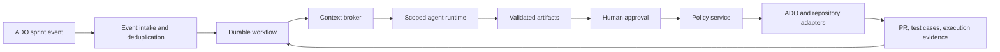

# Architecture

## Design boundary

The framework is language-independent at the workflow and artifact-contract layers. The first implementation may use any supported runtime, model provider, and test-automation stack. Adapters translate between the neutral contracts here and Azure DevOps, source control, test execution, and repository-specific conventions.

## Reference implementation (v1: local, Claude Code-native)

v1 runs on a tester's or build agent's machine next to the local application and automation repos. Each logical component below maps to:

| Component | v1 implementation |
|---|---|
| Event intake | `scripts/sprint_watcher.py` (WIQL on `@CurrentIteration`, scheduled) or manual `/pdlc-run` |
| Durable workflow orchestrator | `scripts/pdlc.py` + `runs/<story>/state.json` (atomic writes; resumable after any crash) driven by `pipeline/pipeline.yaml`; the `/pdlc-run` skill is a thin LLM loop that executes `next` |
| Context broker | `scripts/ado.py fetch-story / fetch-clarifications / export-master-pack`, `scripts/index_steps.py`, plus explicit input lists per stage |
| Agent runtime | Claude Code subagents (`.claude/agents/pdlc-*.md`) with per-agent tool lists |
| Policy and approval service | gates in `pdlc.py` (hash-bound approvals), human-only approve/reject skills, `scripts/guard_writes.py` hook, permission allow/deny in `.claude/settings.json` |
| Artifact store | `runs/<story>/NN-stage/` with `history/` and `feedback/` |
| Integration adapters | `ado.py` (ADO REST), `pdlc.py seal-proposal / apply / verify-diff / run-check` (git worktree + allowlisted commands) |
| Observability and audit | `state.json` history (every claim, completion, reset, approval, apply, publish) and `.pdlc/logs/` for watcher-launched runs |

Moving to a server later means swapping the watcher for an ADO Service Hook, `state.json` for a database, and headless `claude -p` for the Agent SDK. The pipeline file, agents, templates and guidelines carry over unchanged.

## Components

1. **ADO event intake** receives Service Hook events or polls for work-item changes. It verifies the event, resolves the configured project/sprint scope, and deduplicates by event and story revision.
2. **Durable workflow orchestrator** persists state, runs agents, schedules retries, waits for clarification and approvals, and prevents out-of-order transitions. A story/revision is the workflow key.
3. **Context broker** retrieves only allowlisted work items, attachment text, repository metadata, master test cases, standards, and prior approved decisions. It records source links and versions.
4. **Agent runtime** invokes narrowly scoped agents against versioned role instructions and output schemas. It has no direct credentials for unrestricted ADO or repository writes.
5. **Policy and approval service** validates transitions, tool permissions, artifact schemas, approval identity, and scope. Human decisions are recorded as immutable workflow events.
6. **Artifact store** holds analyses, questions, test cases, regression mappings, proposed patches, reviews, and run evidence. Artifacts are versioned and linked to source story revisions.
7. **Integration adapters** implement ADO work-item/test-case operations, source-control reads and branch/PR writes, and test execution. Each adapter exposes bounded operations, not arbitrary shell or API access.
8. **Observability and audit** captures correlation IDs, state changes, model/tool versions, token/cost metrics, failures, approvals, and external writes while redacting secrets.

## Data flow

## Neutral artifact contracts

All agent outputs should be machine-validated JSON or YAML conforming to versioned schemas, then rendered for people. Minimum shared fields:

- `schema_version`, `artifact_id`, `story_id`, `story_revision`, `created_at`
- `status`, `producer`, `source_refs[]`, `guideline_versions[]`
- `content`, plus `assumptions[]`, `risks[]`, and `confidence` where applicable
- `approval` records with decision, identity, timestamp, and artifact hash where a gate applies

Use stable IDs and source references rather than copied story text wherever possible. Preserve a snapshot/hash of the reviewed artifact so later edits invalidate approval.

## Deployment shape

Start with a single orchestrator deployment, durable database/queue, encrypted artifact store, and isolated worker. Keep model access behind a provider interface. Run repository analysis in read-only clones; perform approved changes in short-lived branches or disposable worktrees. Separate credentials by capability: read context, create clarification tasks, publish test cases, and create branches/PRs must be independently granted and audited.

## Reliability

- Treat ADO events as at-least-once; make every external create/update idempotent using a stored operation key and source revision.
- Use bounded retries with backoff for transient integration failures. Do not retry an ambiguous external write until its result is reconciled.
- Pause on missing context, stale story revision, unresolved clarification, invalid artifact, failed gate, or unexpected diff.
- Resume from persisted state; never restart a completed side effect just because a worker restarted.
- Use timeouts, cost limits, input-size limits, and a manual cancellation path.